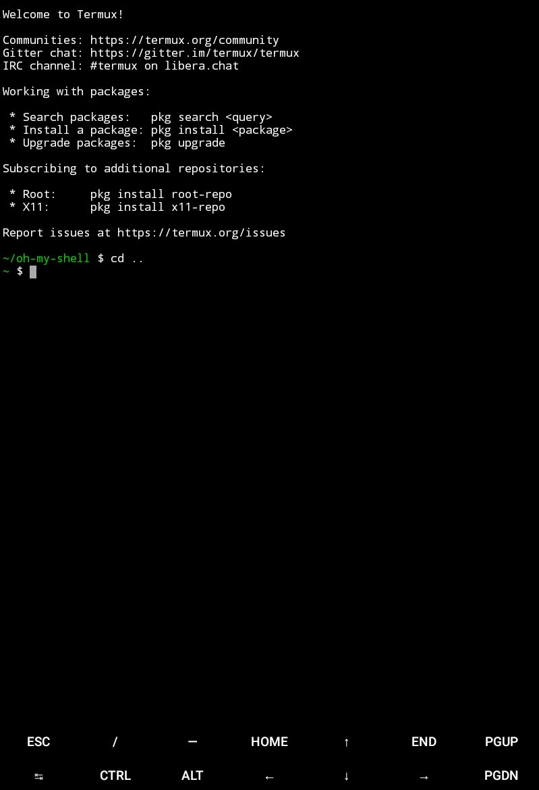
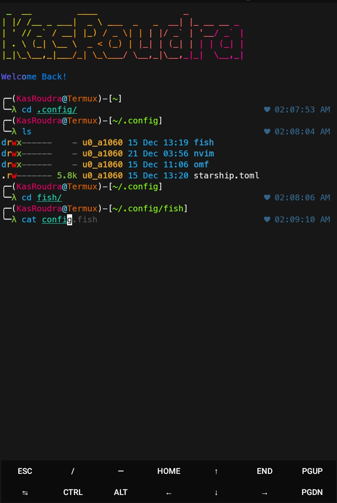

<h1 align="center">Oh-My-Shell</h1>

<p align="center">
  
<!--  
  
  -->
  
<br>
<br>
  
  
  
</p>


### [+] Description :

***Empower your terminal with the might of fish and starship!***

### [+] Installation

#### Clone this repository

 - ```git clone https://github.com/Black0joker/oh-my-shell```

#### Enter the directory
 - ```cd oh-my-shell```

#### Run the tool
 - ```bash install.sh```


#### Or, Directly run

```
bash -c "$(curl -fsSL https://raw.githubusercontent.com/Black0joker/oh-my-shell/main/install.sh)"

```

### Features:

 - Uses Friendly Interactive Shell (Fish)
 - Typing Auto-Suggestion and Syntax-Highlighting (from Fish)
 - Cross platform starship prompt
 - Some cool function
 - Some popular aliases
 - Font to support emojies
 - Easy to use

### Requirements
 - `fish`
 - `git`
 - `ruby or python` (Not required in arch)
 - `figlet`
 - `starship`
 - `eza`
 -  ~40MB storage
 
If not found, all of the required packages will be installed on first run

#### Tested on

 - `Termux`
 - `Kali-Linux`
 - `Arco-Linux`


<h2 align="center">Before</h2>



<h2 align="center">After</h2>




####  Want to show support? Just spread the word and smash the star button

## [~] Find Me on :
- [](https://github.com/Black0joker)

- [](mailto:Black0joker@gmail.com)
 
- [](https://facebook.com/Black0joker)

- [](https://m.me/Black0joker)
